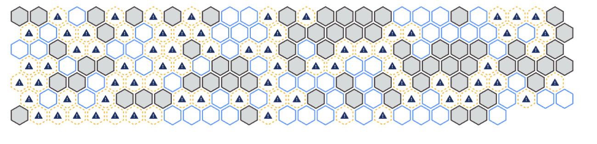
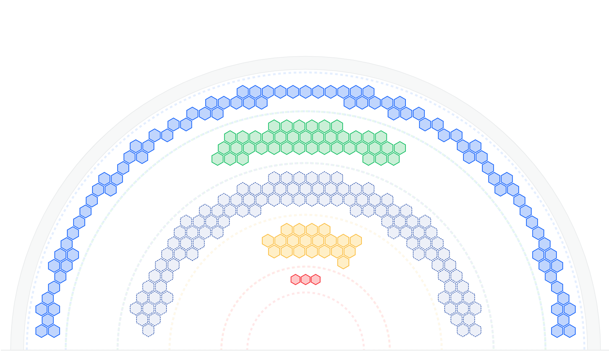

# Hexagon-Chart

Hexagon-Chart is a React component that renders data in a hexagon shape. It supports various options for representing data and is very easy to use.

## Features

- Simple Integration: Easily integrate into any React project.
- Customizable: Supports a wide range of customization options to fit your needs.
- Responsive Design: Automatically adjusts to fit different screen sizes.
- Interactive: Provides interactive features such as tooltips and hover effects.
- Performance: Optimized for performance to handle large datasets efficiently.

## Installation

Install the package using npm or yarn:

```bash
npm install hexagon-chart
```

or

```bash
yarn add hexagon-chart
```

## Examples

Live Playground
For examples of Hexagon-Chart in action, visit https://nkia-development.github.io/hexagon-chart

Or, run the demo storybook on your computer:

```bash
git clone https://github.com/nkia-development/hexagon-chart
npm install
npm run storybook
```

### HexagonChart



```jsx
import { HexagonChart } from "hexagon-chart";

const MyComponent = () => {
  const data = [];
  const option = {};

  return <HexagonChart data={data} option={option} />;
};
```

### PieHexagonChart



```jsx
import { PieHexagonChart } from "hexagon-chart";

const MyComponent = () => {
  const data = [];
  const option = {};

  return <PieHexagonChart data={data} option={option} />;
};
```

## Contributing

See [CONTRIBUTING](CONTRIBUTING.MD) for details on submitting patches and the contribution workflow.

### [Code of Conduct](https://github.com/nkia-development/hexagon-chart/blob/main/CODE_OF_CONDUCT.md)

Nkia has adopted a Code of Conduct that we expect project participants to adhere to. Please read the full text so that you can understand what actions will and will not be tolerated.

### Contributors

<a href="https://github.com/nkia-development/hexagon-chart/graphs/contributors">
  
</a>

### License

Hexagon-chart is [MIT licensed](./LICENSE).
